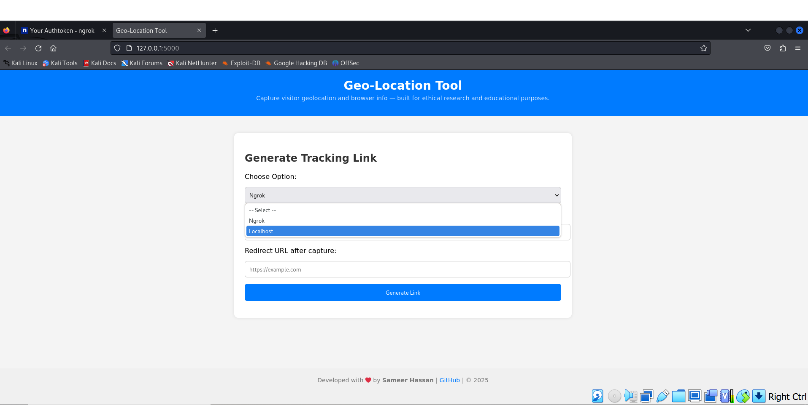
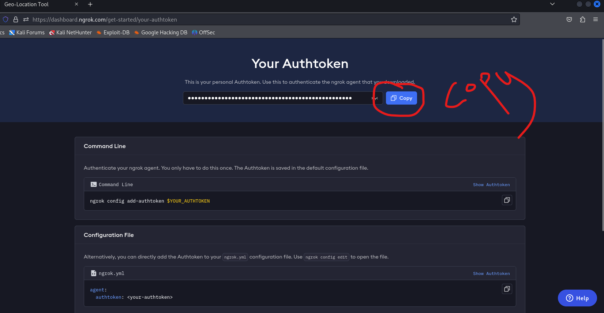
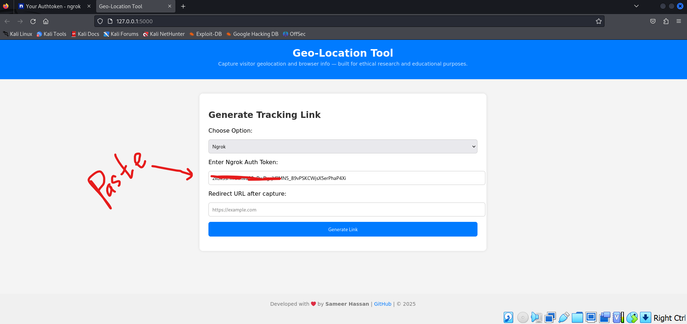
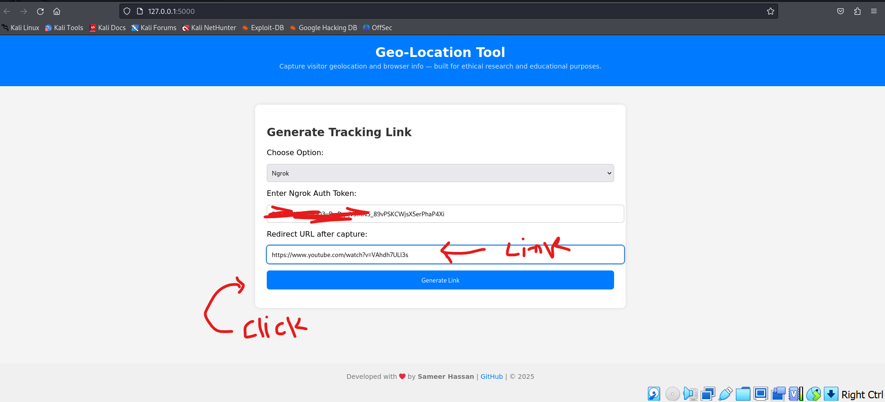
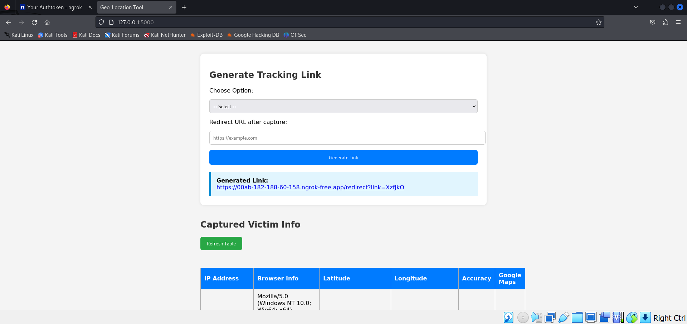

# Geo-Location
Capture visitor geolocation and browser info — built for ethical research and educational purposes.
---

## 🚀 Features

- Generate tracking links via Ngrok or localhost
- Capture visitor IP, browser info, and geolocation
- View captured data in a live-updating table
- Easy to use and customize

---

## 📋 Requirements

- Python 3.8 or higher
- `pip` package manager

---
🧰 Installation & Usage
Follow these steps to set up and run the Location Grabber Tool on your local machine:

## 🛠️ Setup Instructions

1. **Clone the repository:**

   ```bash
   git clone https://github.com/sameerhassancode/Geo-Location
2. **Change the directory:**
   ```bash
   cd Geo-Location
3. **Install the requriments:**
   ```bash
   pip install -r requirements.txt
4. **Start the Tool:**
   ```bash
   python app.py
5. **Open the link in browser:**
   ```bash
   http://127.0.0.1:5000
You’re now ready to generate tracking links and capture data!

## 📸 Screenshots

### 🔍 Dashboard Preview

### 🔍 Select Option

### 🔍 Copy auth token | Ngrok Preview

### 🔍 paste token Preview

### 🔍 Add link and click generate Preview

### 🔍 Victim Preview



